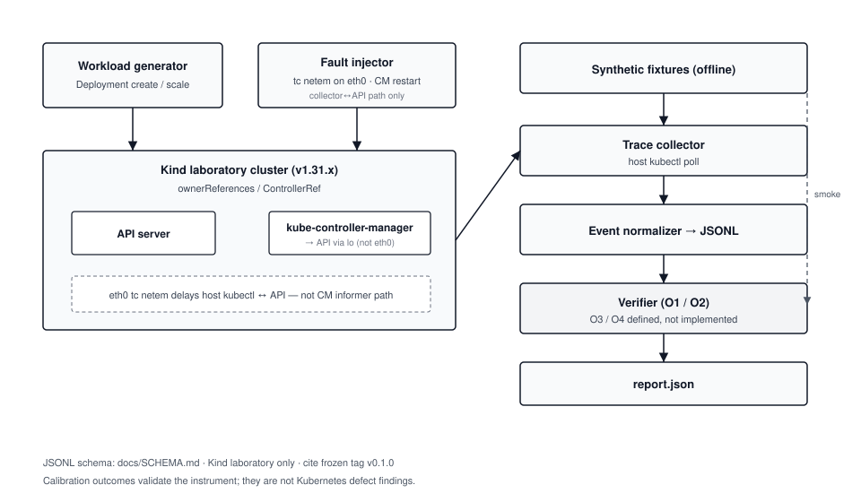

# KOSV: Kubernetes Ownership Safety Verifier

Research instrument for measuring Kubernetes ownership safety (`ownerReferences` / ControllerRef) with explicit oracles, normalized traces, and laboratory fault injection.

KOSV is aimed at researchers studying controller / ownership correctness under controlled conditions. It is not an operator dashboard and does not claim that Kubernetes is safe or unsafe.

License: MIT · SoftwareX gate file: [`Licence.txt`](Licence.txt) (same text as [`LICENSE`](LICENSE))

## Quick Start (3 steps)

### 1. Offline smoke (no cluster; ≪10 minutes)

```bash
git clone https://github.com/kazuru-chidumbwe/k8s-ownership-safety-verifier.git
cd k8s-ownership-safety-verifier
git checkout v0.1.7   # package cite pin

make smoke-fixtures
```

Runs synthetic O1 FAIL, O2 FAIL, intended-orphan PASS, and cross-resource UID PASS fixtures through the verifier. Dependencies: Python 3 standard library only (see [`requirements.txt`](requirements.txt)).

### 2. Optional Kind laboratory smoke

```bash
make smoke          # fixtures + Kind clean Deployment create/scale
# or: make smoke-kind
```

Requires Docker, `kind`, and `kubectl`. Kind is a **laboratory** cluster only; see [`docs/SCOPE-ISOLATION.md`](docs/SCOPE-ISOLATION.md).

### 3. Cite the frozen tag

```text
Seke Kazuru. KOSV: Kubernetes Ownership Safety Verifier.
https://github.com/kazuru-chidumbwe/k8s-ownership-safety-verifier
Tag: v0.1.7
```

Methodology / package cite: **`v0.1.7`** (includes primary matrix from `v0.1.6` plus denser-poll `--poll-interval`); see [`docs/TAGS.md`](docs/TAGS.md). The old essay tag `blog-kosv01-2026-07` was deleted (superseded pre-fault-reach snapshot). Add the journal / Zenodo citation when published.

**Primary validation matrix (lab):** id **`20260814T083135Z`**, Kind **`kindest/node:v1.34.0`**, **20/20 PASS** O1/O2 under stated faults. Run locally with `make matrix` (needs Docker/`kind`/`kubectl`). Analysis: [`MATRIX-ANALYSIS.md`](MATRIX-ANALYSIS.md). Host `delay_proxy` self-tests in each run are **tool calibration**; O1/O2 PASS/FAIL outcomes are **instrument validation**.

**Seeded violation arms:** `python experiments/run_seeded_violations.py` (observation-layer O1/O2 injection; 2/2 detected on stamp `seeded-20260814T055833Z`).

## Architecture



*Figure: Workload generation and fault injection drive a Kind laboratory cluster; ownership observations are collected, normalized to JSONL, and evaluated by the verifier (O1/O2). Synthetic fixtures exercise the verifier without a cluster. Kind `eth0` `tc netem` delays the host collector (`kubectl`)↔API path; controller-manager↔API on single-node Kind is local (`lo`) and is not delayed by `eth0` netem. Details: [`docs/ARCHITECTURE.md`](docs/ARCHITECTURE.md).*

## Oracles (v0)

| Oracle | Predicate | Status |
| --- | --- | --- |
| O1 Snapshot SCOI (Single Controller Ownership Invariant) | At any recorded event, `count(controller=true) ≤ 1` | Implemented |
| O2 Unintended transfer | ControllerRef A→B on same `(resource, uid)` without expected orphan/DELETE | Implemented |
| O3 Observation mismatch | Controller belief ≠ API ControllerRef | Defined, not implemented |
| O4 Behavioral thrash | Ownership fight / thrash while O1 holds | Defined, not implemented |

## Extending

Concrete reuse paths (new ownership path, new oracle, O3 once belief traces exist, richer faults, multi-CP labs) are documented in [`docs/EXTENDING.md`](docs/EXTENDING.md).

## Documentation

| Doc | Role |
| --- | --- |
| [`docs/ARCHITECTURE.md`](docs/ARCHITECTURE.md) | Components + diagram |
| [`docs/SCHEMA.md`](docs/SCHEMA.md) | Normalized JSONL trace schema |
| [`docs/THREAT-MODEL.md`](docs/THREAT-MODEL.md) | Adversary / trust assumptions |
| [`docs/evidence/fault-reach-2026-07-27/`](docs/evidence/fault-reach-2026-07-27/) | Primary evidence: eth0 netem path reach |
| [`docs/TAGS.md`](docs/TAGS.md) | SemVer + citation pins |
| [`docs/TERMINOLOGY.md`](docs/TERMINOLOGY.md) | Calibration vs validation |
| [`CHANGELOG.md`](CHANGELOG.md) | SemVer history |
| [`REPRODUCTION.md`](REPRODUCTION.md) | Independent cold-reproduction record |
| [`docs/SCOPE-ISOLATION.md`](docs/SCOPE-ISOLATION.md) | Kind lab scope / isolation |
| [`docs/EXTENDING.md`](docs/EXTENDING.md) | Add ownership path or oracle |
| [`EVIDENCE.md`](EVIDENCE.md) | Smoke evidence summary |
| [`MATRIX-ANALYSIS.md`](MATRIX-ANALYSIS.md) | 20-run instrument validation analysis |

## Layout

| Path | Role |
| --- | --- |
| `verifier/check.py` | O1/O2 predicates over JSONL traces |
| `fixtures/` | Synthetic O1 FAIL, O2 FAIL, intended orphan PASS |
| `collector/` | kubectl-oriented collection helpers |
| `injector/` | Delay tooling (`tc netem` on Kind `eth0` = collector↔API path; optional host delay_proxy for self-tests) |
| `experiments/` | Fixture smoke, Kind smoke, matrix, scale runners |
| `results/` | Committed smoke reports |
| `matrix/runs/` | Instrument-validation archives |

## Claim discipline

- Smoke + matrix results validate the instrument.
- They are not Kubernetes vulnerability findings.
- Poll-based collection is incomplete; PASS ≠ proof of absence.
